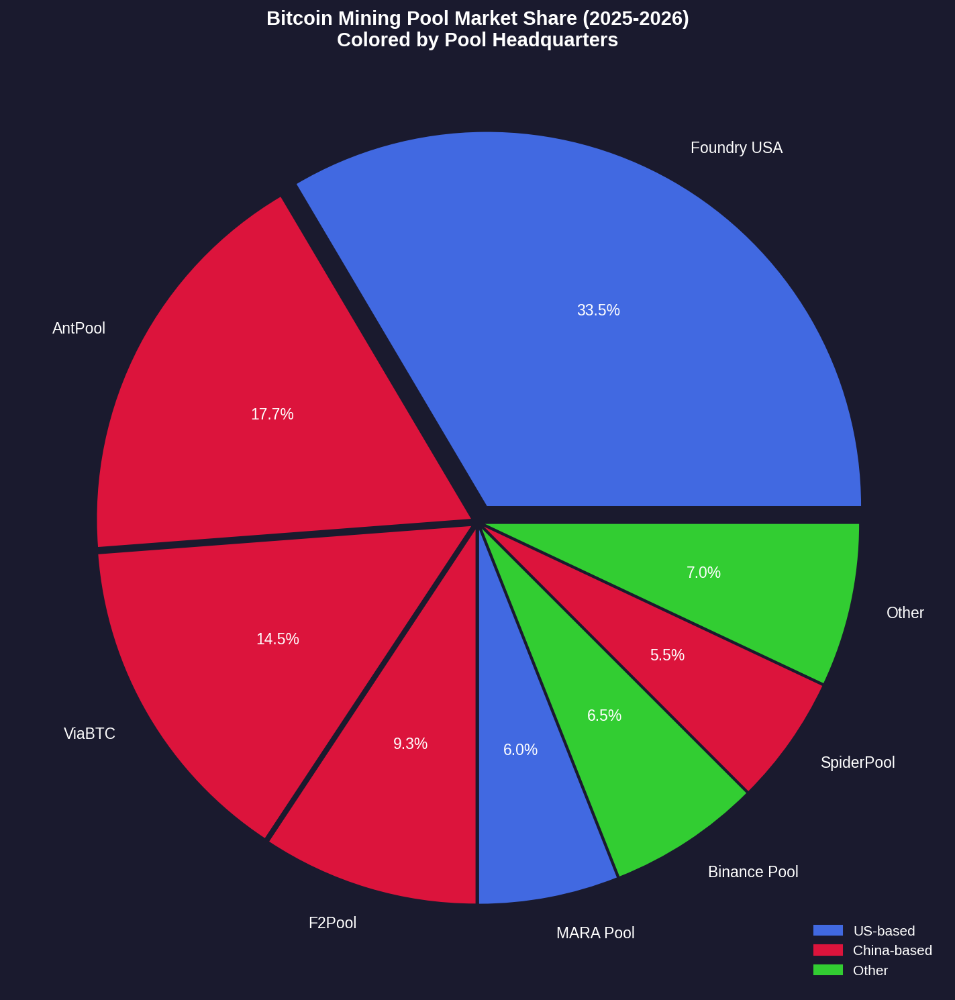
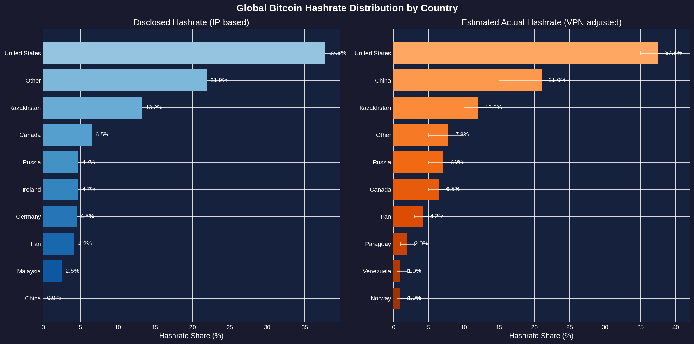
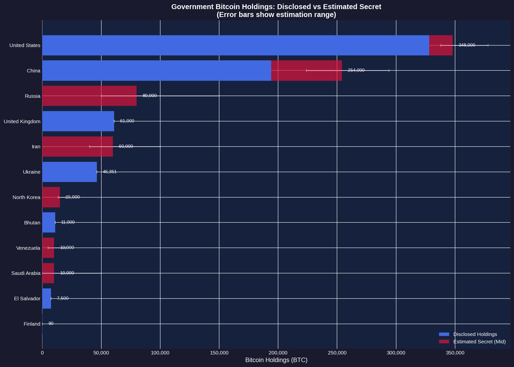
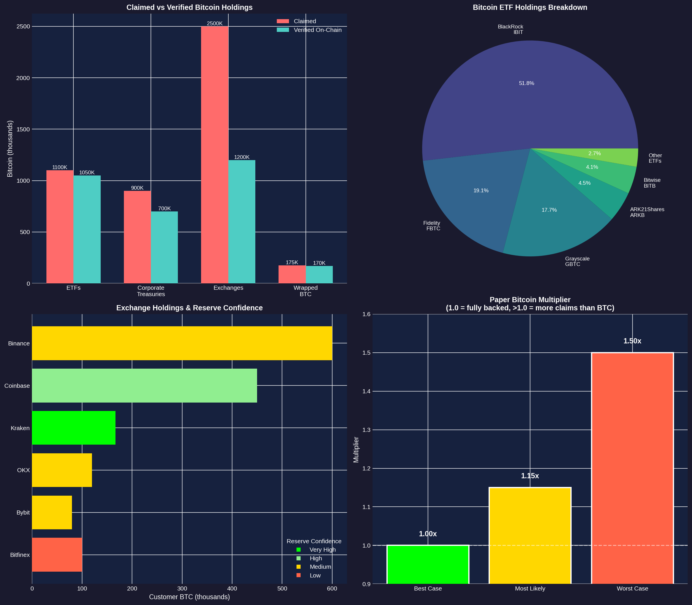
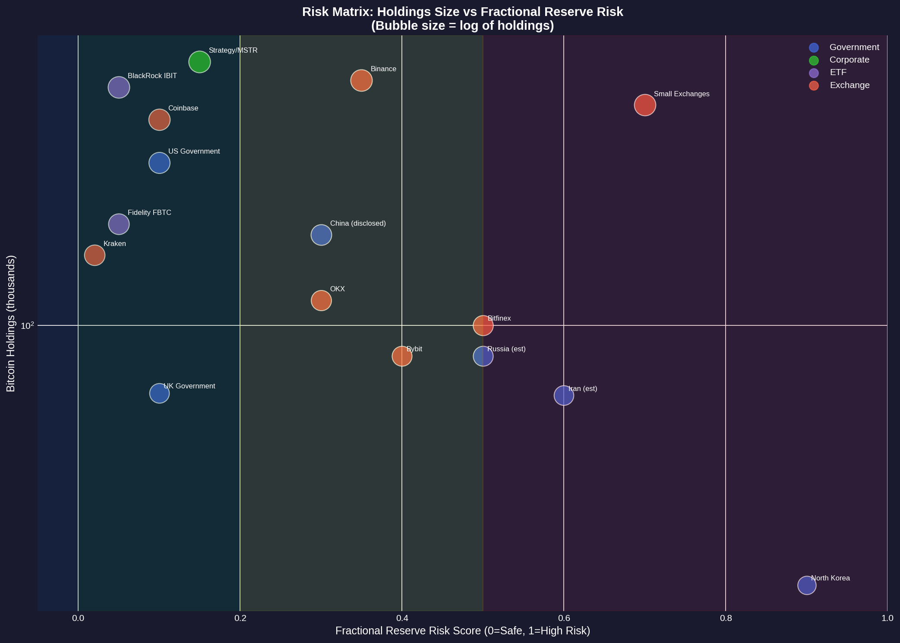
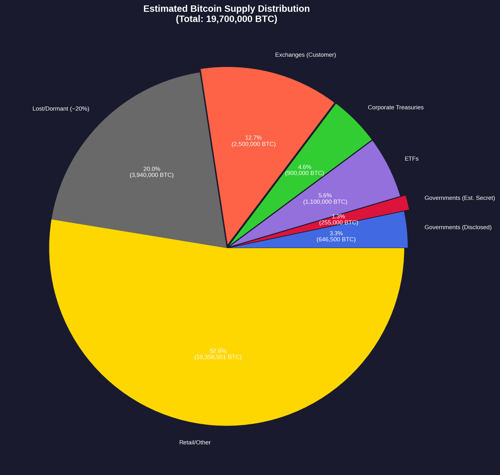

# Bitcoin Geopolitics Analysis Report
## Global Hashrate Distribution, Government Holdings & Paper Bitcoin Circulation

**Report Date:** February 2, 2026
**Author:** Bitcoin Geopolitics Analyst
**Classification:** Open Source Intelligence Analysis

---

## Executive Summary

This report provides a comprehensive analysis of three critical dimensions of Bitcoin's geopolitical landscape:

1. **Global Hashrate Distribution** - Where Bitcoin mining power actually originates
2. **Government Holdings** - Both disclosed and estimated secret nation-state Bitcoin accumulation
3. **Paper Bitcoin Circulation** - The gap between claimed and verifiable Bitcoin holdings

### Key Findings

| Metric | Value | Confidence |
|--------|-------|------------|
| **Hashrate: China's actual share** | 15-25% (vs 0% disclosed) | Medium |
| **Total government BTC (disclosed + secret)** | 800K-1.1M BTC (4-5.5% of supply) | Low-Medium |
| **Paper Bitcoin multiplier** | 1.15x (15% more claims than verified) | Medium |
| **Estimated phantom BTC** | ~700,000 BTC | Low |

---

## Part 1: Global Bitcoin Hashrate Distribution

### 1.1 Mining Pool Market Share

The Bitcoin mining industry is highly concentrated, with **six pools controlling over 95%** of all block production.

| Pool | Market Share | Headquarters | Hashrate (EH/s) |
|------|-------------|--------------|-----------------|
| **Foundry USA** | 33.5% | United States | 277 |
| **AntPool** | 17.7% | China (Bitmain) | 146 |
| **ViaBTC** | 14.5% | China | 120 |
| **F2Pool** | 9.3% | China | 77 |
| **MARA Pool** | 6.0% | United States | 50 |
| **Binance Pool** | 6.5% | Cayman Islands | 54 |
| **SpiderPool** | 5.5% | China | 45 |
| **Other** | 7.0% | Various | 58 |

**Key Insight:** While Foundry USA is the largest single pool, Chinese-controlled pools (AntPool, F2Pool, ViaBTC, SpiderPool) collectively control **~47%** of global hashrate.



### 1.2 Disclosed vs Estimated Actual Hashrate by Country

The Cambridge Bitcoin Electricity Consumption Index (CBECI) provides disclosed hashrate based on IP addresses reported to mining pools. However, this data is significantly affected by VPN and proxy usage.

#### Disclosed Hashrate (IP-Based)

| Country | Share | Confidence | Notes |
|---------|-------|------------|-------|
| United States | 37.8% | High | Includes Foundry USA, MARA Pool |
| Kazakhstan | 13.2% | Medium | Cheap electricity, stable regulations |
| Russia | 4.7% | Medium | Likely understated |
| Canada | 6.5% | High | Hydro-powered mining |
| Germany | 4.5% | Low | **Inflated by VPN usage** |
| Ireland | 4.7% | Low | **Inflated by VPN usage** |
| China | 0.0% | Low | Officially banned since 2021 |
| Iran | 4.2% | Medium | State-sponsored mining |

#### Estimated Actual Hashrate (VPN-Adjusted)

| Country | Low | Mid | High | Evidence |
|---------|-----|-----|------|----------|
| **United States** | 35% | 37.5% | 40% | Reliable public company data |
| **China** | 15% | 21% | 25% | Cambridge CDAP shows 21% covert |
| **Kazakhstan** | 10% | 12% | 15% | Stable since China migration |
| **Russia** | 5% | 7% | 10% | State-linked shadow mining |
| **Iran** | 3% | 4.2% | 5% | 427K mining devices documented |
| **Canada** | 5% | 6.5% | 8% | Transparent hydro operations |
| **Germany** | 0.5% | 1% | 2% | Actual much lower than reported |
| **Ireland** | 0.5% | 1% | 2% | VPN destination, not mining |



### 1.3 China's Hidden Mining Operation

Despite the 2021 ban, China remains a major Bitcoin mining hub:

**Evidence:**
- Cambridge Digital Assets Programme (CDAP) data shows **21% of hashrate** comes from covert Chinese miners
- Underground miners use foreign proxy services to hide activity
- Recent December 2025 shutdown of **1.3GW capacity in Xinjiang** (~400,000 machines) suggests ongoing large-scale operations
- Four of the top seven mining pools are Chinese-operated

**Estimation Methodology:**
- China controlled ~70% of hashrate in 2017-2021
- Approximately 1.47 million BTC mined by Chinese entities in that period
- Despite official ban, covert operations continue at 15-25% of global hashrate
- Local proxy services provide protection from enforcement

### 1.4 State-Sponsored Mining: Russia & Iran

**Russia:**
- New 2024 legislation legitimized mining with mandatory reporting to Rosfinmonitoring
- State-linked entities mine in "shadow territories" using excess gas flaring capacity
- Launched A7A5 ruble-backed token transacting $93.3B for sanctions evasion
- U.S. Treasury sanctioned 13 blockchain firms in March 2025

**Iran:**
- Controls 4.2% of global hashrate (5th largest)
- 427,000 active mining devices documented
- IRGC (Revolutionary Guard) linked to mining operations
- Electricity costs $0.01-0.05/kWh, enabling $1,300 mining cost per BTC
- Oil-to-Bitcoin conversion for sanctions bypass

---

## Part 2: Government Bitcoin Holdings

### 2.1 Publicly Disclosed Holdings

| Country | BTC Held | USD Value | Source | Status |
|---------|----------|-----------|--------|--------|
| **United States** | 328,000 | $27.5B | Seizures (Silk Road, Bitfinex, Chen Zhi) | Strategic Reserve (March 2025 EO) |
| **China** | 194,000 | $16.3B | PlusToken seizure | Likely sold through mixers |
| **United Kingdom** | 61,000 | $5.1B | Money laundering seizures | Held, no policy |
| **Ukraine** | 46,351 | $3.9B | Donations, seizures | Partially liquidated |
| **Bhutan** | 11,000 | $0.92B | State hydro mining | Actively accumulating |
| **El Salvador** | 7,500 | $0.63B | Market purchases | Strategic reserve |
| **Germany** | 0 | $0 | Movie2k seizure | **Sold July 2024** |

**Total Disclosed:** ~648,000 BTC (3.3% of total supply)

### 2.2 Estimated Secret Holdings

| Country | Disclosed | Est. Secret (Range) | Confidence | Evidence |
|---------|-----------|---------------------|------------|----------|
| **China** | 194K (sold?) | 30K-100K | Medium | Ongoing mining, pool control |
| **Russia** | 0 | 50K-150K | Low | Shadow mining, sanctions evasion |
| **Iran** | 0 | 40K-100K | Medium | State mining since 2019 |
| **North Korea** | 0 | 13.5K-20K | High | Documented Lazarus holdings |
| **Venezuela** | 0 | 5K-20K | Low | Sanctions evasion |
| **USA (additional)** | 328K | +10K-50K | Low | Intelligence operations |

**Total Estimated Secret:** 148,500 - 490,000 BTC



### 2.3 Case Study: North Korea

The Democratic People's Republic of Korea represents a unique case of state-level cryptocurrency accumulation through cybercrime:

**Bybit Hack (February 21, 2025):**
- Lazarus Group executed the largest crypto heist in history
- Stole $1.5B in Ethereum from Bybit
- Converted 86.29% to **13,518 BTC** within one month
- FBI confirmed attribution within one week

**Total Estimated North Korean Holdings:**
- 13,518 BTC (converted from Bybit hack)
- Additional holdings from historical hacks (Ronin, Harmony, etc.)
- Funds nuclear and ballistic missile programs
- Now **third largest government holder** after US and UK

### 2.4 Aggregate Analysis

| Metric | Low Estimate | Mid Estimate | High Estimate |
|--------|--------------|--------------|---------------|
| Total Government BTC | 796,500 | 903,000 | 1,138,000 |
| % of Total Supply | 4.04% | 4.58% | 5.77% |
| vs MicroStrategy | 1.16x | 1.31x | 1.66x |

**Comparison:**
- Governments likely hold **more BTC than all public companies combined** (est. 850,000 BTC)
- MicroStrategy alone holds 687,000 BTC
- Nation-state accumulation is a significant and growing trend

---

## Part 3: Paper Bitcoin Analysis

### 3.1 What is "Paper Bitcoin"?

Paper Bitcoin refers to claims on Bitcoin that may not be fully backed by actual on-chain BTC. This includes:
- ETF shares
- Exchange IOUs
- Custody receipts
- Wrapped tokens
- Potential rehypothecation

### 3.2 Bitcoin ETFs

| ETF | BTC Claimed | Custodian | Verified | Confidence |
|-----|-------------|-----------|----------|------------|
| BlackRock IBIT | 570,000 | Coinbase Custody | Yes | High |
| Fidelity FBTC | 210,000 | Fidelity Digital | Yes | High |
| Grayscale GBTC | 195,000 | Coinbase Custody | Yes | High |
| ARK21Shares | 50,000 | Coinbase Custody | Yes | High |
| Bitwise BITB | 45,000 | Coinbase Custody | Yes | High |
| Other | 30,000 | Various | Partial | Medium |

**Total ETF BTC:** ~1,100,000 BTC
**Risk Assessment:** Low fractional reserve risk due to SEC oversight and creation/redemption mechanisms

**Custodian Concentration Risk:** Coinbase Custody holds BTC for multiple ETFs representing ~$80B+ in assets - a significant single point of failure.

### 3.3 Corporate Treasuries

| Company | BTC Claimed | Custody | Leverage | Confidence |
|---------|-------------|---------|----------|------------|
| Strategy (MSTR) | 687,000 | Mixed | Yes ($7.5B debt) | High |
| Marathon (MARA) | 53,250 | Mixed | Yes | High |
| Riot Platforms | 14,548 | Third-party | No | High |
| Coinbase | 13,696 | Self | No | High |
| Hut 8 | 13,011 | Self | Partial | High |
| Tesla | 9,720 | Unknown | No | Medium |
| Block/Square | 8,027 | Self | No | Medium |

**Total Corporate:** ~900,000 BTC

### 3.4 Exchange Holdings

| Exchange | Customer BTC | PoR Method | Reserve Ratio | Confidence |
|----------|--------------|------------|---------------|------------|
| **Binance** | 600,000 | zk-SNARK | 100%+ claimed | Medium |
| **Coinbase** | 450,000 | SEC filings | 100% claimed | High |
| **Kraken** | 167,000 | Merkle tree | **114.9% verified** | Very High |
| **OKX** | 120,000 | zk-SNARK | 100%+ claimed | Medium |
| **Bybit** | 80,000 | Merkle tree | Recovering | Medium |
| **Bitfinex** | 100,000 | Limited | Unknown | Low |
| **Other** | 983,000 | Various/None | Unknown | Low |

**Total Exchange:** ~2,500,000 BTC claimed

**Kraken Case Study:** Kraken demonstrates best-in-class transparency with 114.9% reserve ratio (192,091 BTC held vs 167,189 BTC owed to customers) - verified by independent third-party auditor.

### 3.5 Wrapped/Tokenized Bitcoin

| Product | BTC Claimed | Custodian | Verified | Chain |
|---------|-------------|-----------|----------|-------|
| WBTC | 129,000 | BitGo | Yes | Ethereum |
| cbBTC | 43,000 | Coinbase | Yes | Base, Solana |
| Other | 3,000 | Various | Partial | Various |

**Total Wrapped:** ~175,000 BTC

### 3.6 Paper Bitcoin Multiplier Calculation

```
Paper Bitcoin Multiplier = Total Claimed / Verifiable On-Chain

Where:
- Total Claimed = ETFs + Treasuries + Exchanges + Wrapped = 4,675,000 BTC
- Verifiable = 3,120,000 BTC (conservatively verified on-chain)
```

| Scenario | Multiplier | Assumption | Implied Phantom BTC |
|----------|------------|------------|---------------------|
| **Best Case** | 1.00x | 100% reserves everywhere | 0 |
| **Most Likely** | 1.15x | Exchanges at 92%, minor overlaps | ~700,000 |
| **Worst Case** | 1.50x | 80% reserves, rehypothecation | ~1,500,000 |



### 3.7 Systemic Risk Assessment

**Highest Risk Entities:**
1. **Small offshore exchanges** - No regulation, no PoR, history of exit scams
2. **Binance** - Regulatory uncertainty, complex structure, PoR methodology questioned
3. **Bitfinex** - Historical hack, Tether connection, limited transparency

**Custodian Concentration:**
- Coinbase Custody holds ~2,200,000 BTC across ETFs and institutional accounts
- Represents ~45% of all institutional Bitcoin
- Single point of failure risk

**Bank Run Scenario:**
If all holders demanded proof of reserves simultaneously:
- Estimated shortfall: 200,000 - 750,000 BTC
- Most vulnerable: Small exchanges, offshore platforms
- Major institutions (ETFs, public companies) likely adequately reserved

**Comparison to Traditional Finance:**
- Traditional bank reserve ratio: ~10%
- Estimated crypto exchange ratio: ~92%
- Crypto generally better reserved, but unregulated entities present risk



---

## Part 4: Supply Distribution Overview



### Estimated Bitcoin Supply Distribution

| Category | BTC | % of Supply | Notes |
|----------|-----|-------------|-------|
| Governments (Disclosed) | 648,000 | 3.3% | Known holdings |
| Governments (Est. Secret) | 255,000 | 1.3% | Mid estimate |
| Bitcoin ETFs | 1,100,000 | 5.6% | Rapid growth in 2025 |
| Corporate Treasuries | 900,000 | 4.6% | MicroStrategy dominates |
| Exchanges (Customer) | 2,500,000 | 12.7% | Various confidence levels |
| Lost/Dormant | 3,940,000 | 20.0% | Satoshi coins, lost keys |
| Retail/Other | 10,357,000 | 52.5% | Individual holders |
| **Total** | **19,700,000** | **100%** | |

---

## Key Insights & Conclusions

### 1. Where is hashrate really coming from?

- **United States** leads with 35-40% of global hashrate (confirmed)
- **China** maintains 15-25% through covert operations (despite official ban)
- **Russia** and **Iran** operate state-sponsored mining for sanctions evasion
- **VPN obfuscation** makes precise attribution difficult
- **Chinese pools** (AntPool, F2Pool, ViaBTC, SpiderPool) control ~47% of block production regardless of miner location

### 2. How much Bitcoin do nation-states really control?

- **Disclosed:** ~648,000 BTC (3.3% of supply)
- **Estimated undisclosed:** 150,000-490,000 BTC (0.8-2.5%)
- **Total:** ~4-6% of all Bitcoin may be controlled by nation-states
- **Trend:** Increasing accumulation, especially by US (seizures) and sanctioned nations (mining)

### 3. How much paper Bitcoin exists?

- **Paper Bitcoin multiplier:** ~1.15x (most likely scenario)
- **Implied phantom BTC:** ~700,000 BTC more claimed than can be verified
- **Highest risk:** Small/offshore exchanges with no proof of reserves
- **Lowest risk:** US ETFs, public companies with audited holdings

### 4. Critical Observations

1. **Accumulation is accelerating** - Both nation-states and corporations are treating Bitcoin as a strategic reserve asset

2. **Transparency varies wildly** - From Kraken (114.9% verified reserves) to small exchanges (no verification)

3. **Custodian concentration risk** - Coinbase controls ~45% of institutional Bitcoin custody

4. **Sanctions evasion driving adoption** - Russia, Iran, North Korea using Bitcoin to bypass financial controls

5. **China's influence persists** - Despite ban, Chinese entities control significant mining infrastructure

### 5. What happens if there's a "run on Bitcoin"?

If all institutions had to prove reserves simultaneously:
- **ETFs:** Would likely pass (SEC-regulated, audited)
- **Public companies:** Would likely pass (financial disclosures)
- **Major exchanges:** Mixed results (Kraken excellent, others uncertain)
- **Small exchanges:** Potential failures and contagion
- **Estimated total shortfall:** 200,000-750,000 BTC
- **Systemic risk:** Medium - major holders adequately reserved; tail risk from unregulated entities

---

## Methodology & Data Quality

### Sources Used

| Category | Primary Sources | Confidence Level |
|----------|-----------------|------------------|
| Hashrate | Cambridge CBECI, Hashrate Index, Mining pools | Medium-High |
| Government Holdings | BitcoinTreasuries.net, CoinGecko, Court records, Arkham | Medium-High |
| ETFs | SEC filings, Company disclosures | High |
| Exchanges | Proof of Reserves, CoinGlass | Low-Medium |
| Estimates | Multi-source triangulation | Low-Medium |

### Limitations

1. **VPN/Proxy obfuscation** makes hashrate attribution imprecise
2. **Secret holdings** are by definition unverifiable
3. **Exchange reserves** vary in verification quality
4. **Data timeliness** - crypto markets move faster than reporting

### Confidence Levels

- **High:** Multiple independent sources, on-chain verification
- **Medium:** Reputable source with partial verification
- **Low:** Single source, extrapolation, or speculation

---

## References

1. [Cambridge CBECI Mining Map](https://ccaf.io/cbnsi/cbeci/mining_map)
2. [Hashrate Index](https://hashrateindex.com/hashrate/pools)
3. [CoinGecko Government Holdings Report](https://www.coingecko.com/research/publications/government-bitcoin-holdings)
4. [BitcoinTreasuries.net](https://bitcointreasuries.net)
5. [Kraken Proof of Reserves](https://www.kraken.com/proof-of-reserves)
6. [Binance Proof of Reserves](https://www.binance.com/en/proof-of-reserves)
7. [CoinGlass ETF Data](https://www.coinglass.com/etf/bitcoin)
8. [Chainalysis 2026 Crypto Crime Report](https://www.chainalysis.com/blog/2026-crypto-crime-report-introduction/)
9. [FBI Bybit Hack Attribution](https://www.ic3.gov/psa/2025/psa250226)
10. [Decrypt: Covert Chinese Miners](https://decrypt.co/100668/covert-chinese-bitcoin-miners-still-account-for-21-of-network-hashrate-report)

---

*This report represents open source intelligence analysis based on publicly available data. All estimates include confidence levels and should be interpreted with appropriate uncertainty.*
